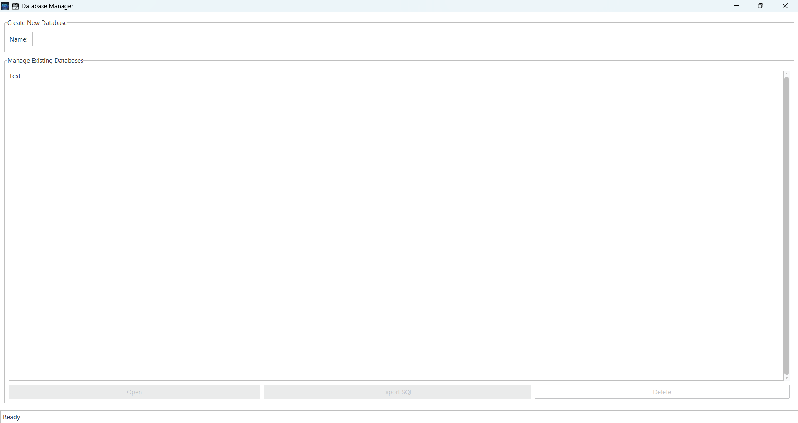

# 🗃️ User-Friendly Database Manager

[](https://opensource.org/licenses/MIT)
[](https://www.python.org/)

A simple, modern, and user-friendly desktop application for managing SQLite databases. Built with Python, Tkinter, and ttkbootstrap.



## Features

- **Create & Delete Databases:** Easily manage your database files.
- **Manage Tables:** Create, delete, and view tables within a database.
- **Data Manipulation:** Add, edit, and delete rows with a user-friendly interface.
- **Robust Import/Export:** Export tables to CSV and entire databases to SQL scripts.
- **Modern UI:** A clean and modern interface built with custom-themed widgets.

## Installation (For Users)

1.  Go to the [**Releases**](https://github.com/Noyonbond47/User-Friendly-Database-Manager/releases) page.
2.  Download the latest `.exe` file from the Assets section.
3.  Run the executable. No installation is required!

## Building from Source (For Developers)

If you want to run the application directly from the source code, follow these steps.

1.  **Clone the repository:**
    ```bash
    git clone https://github.com/Noyonbond47/User-Friendly-Database-Manager.git
    cd User-Friendly-Database-Manager
    ```

2.  **Create and activate a virtual environment:**
    ```bash
    # On Windows
    python -m venv venv
    .\venv\Scripts\activate

    # On macOS/Linux
    python3 -m venv venv
    source venv/bin/activate
    ```

3.  **Install the required packages:**
    ```bash
    pip install -r requirements.txt
    ```

4.  **Run the application:**
    ```bash
    python app_ui.py
    ```

---
*This project was developed with assistance from Gemini Code Assist.*
